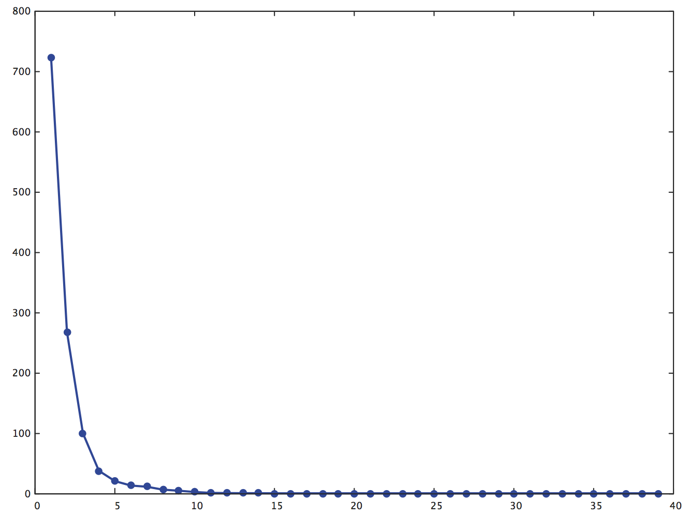

# Fast bundle level methods for unconstrained and ball-constrained convex optimization
This is a [torch](http://torch.ch/)-based implementation of two types of bundle level algorithms which could be found [here](http://arxiv.org/abs/1412.2128). Author's webpage also contains the original [Matlab codes](http://arxiv.org/abs/1412.2128).

## Fast APL
Fast accelerated prox-level(APL) is an variant of APL developed by Wei Zhang. Its core functionalities, including iteration scheme, gap reduction, and prox-centering are contained in [fastAPL.lua](fastAPL.lua?raw=true). The demo code shows an example of fast APL on solving quadratic programming problem. The objective function value during iteration is as follows

## Fast USL
Fast uniform smoothing level(USL) extends the fast APL to solve one specific type of structured non-smooth problem. It almost has the same iteration scheme except the extra estimation of smoothing parameters. The demo codes show an expamle of brain image reconstruction with TV regularization.

<figure>
 
</figure>

<figure>

</figure>

### dualSolver.lua
Both two methods spend their compuation time on the subproblem of center projection, which is solved by its dual form. The dual problem is them formulated into an linear equation and solved by brute force enumeration  (in [permuteMatrix.lua](permuteMatrix.lua?raw=true)), which is not so scary as it may sound since the number of dual variables are quite small, 5, for instance. The [dualSolver.lua](dualSolver.lua?raw=true) provides the implementation for solving the linear equation during dual optimization.

I provided the multi-thread version implementation for finding all possiable non-zero entries of dual vectors. But you shall not use them because they are slower. And callback function in each thread can change the global variable in current version.

## miscellaneous
* This implementation is not as fast as the matlab experiments in the paper on my Mac. I am thinking it is the memory limit of luajit, but I am not sure.
* You should be careful with the error tolerance settings in the dualSolver because they are critical for the upper-bound lowwer-bound gap to converge to zero.

