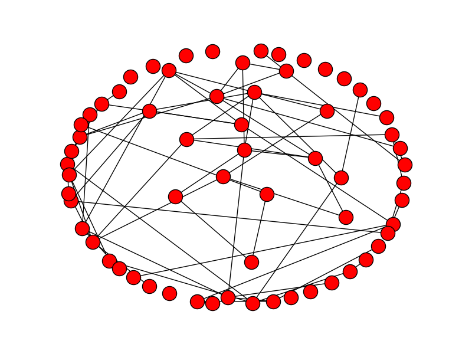
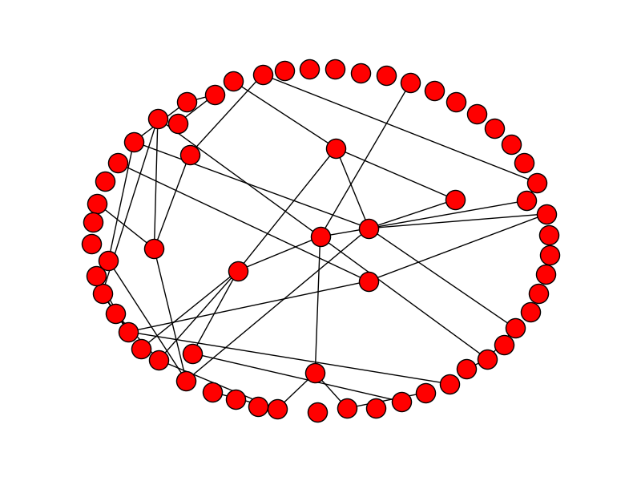
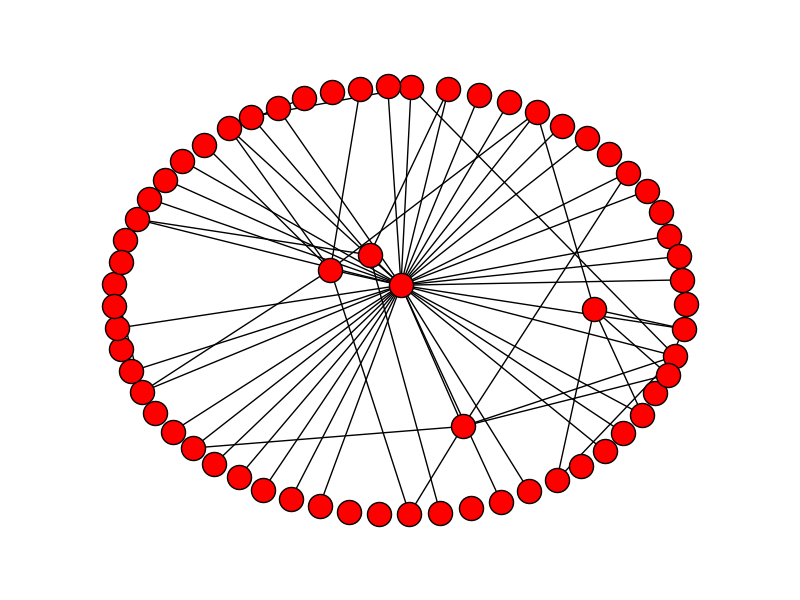
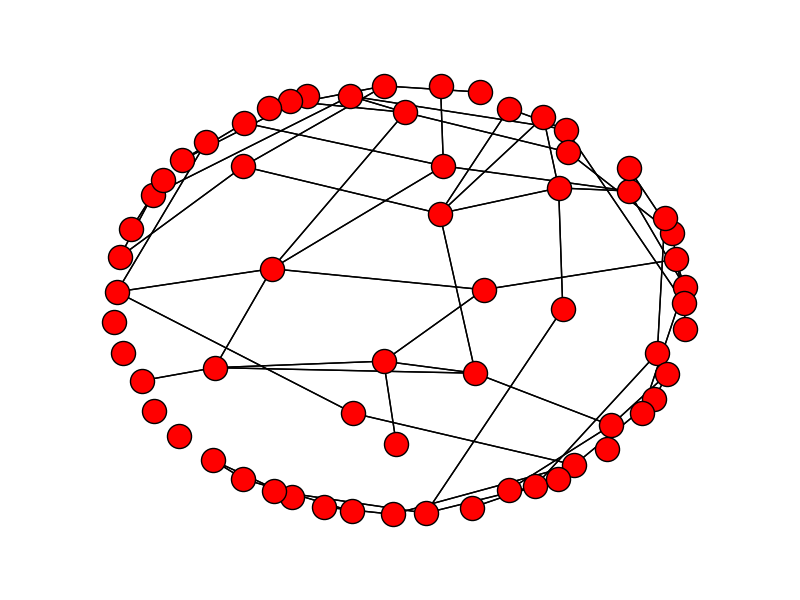
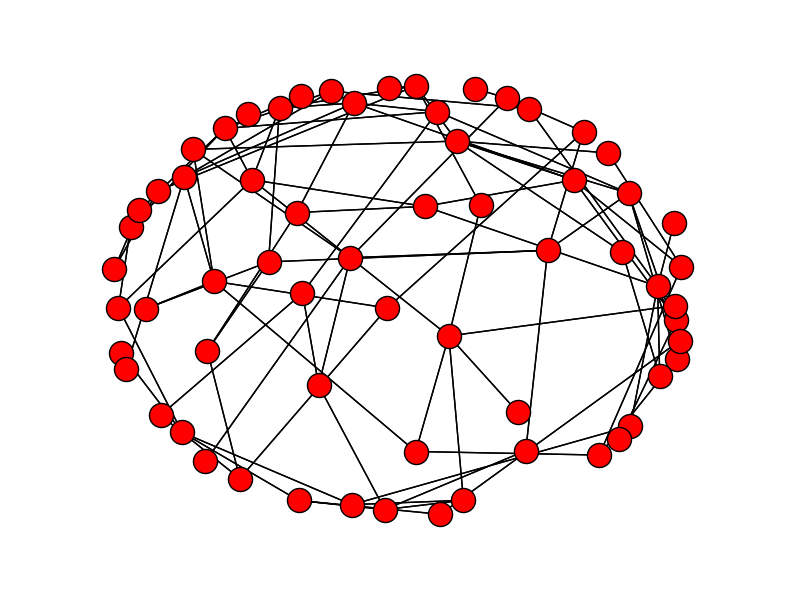

# Report on diffusion dynamics estimation of random network

### Shuhang

## Experiments on [Netrate](https://people.mpi-sws.org/~manuelgr/pubs/netrate-icml11.pdf)

First of all, I must apologize that I made a mistake in the last run of experiments on this paper. I did not notice the estimated adjacency matrix was transposed during evaluation. I should have been more careful.

This time I ran two groups of experiments. The first group consists of testing three kinds of Kronecker network models in the author's [thesis](https://people.mpi-sws.org/~manuelgr/pubs/thesis-manuelgr-final.pdf).

**Kronecker network:** A Kronecker network of order $k$ is defined by the adjacency matrix $K_1^{[k]}$, where $K_1$ is the initiator adjacency matrix.

1. $K_1=[0.5,0.5;0.5,0.5]$ for Erdos and Renyi random graph.
2. $K_1=[0.9,0.5;0.5,0.1]$ for Core-periphery networks.
3. $K_1=[0.9,0.1;0.1,0.9]$ for Hierarchical community structure. 

$K_1^{[k]}$ means the $k$-th Kronecker power (Kronecker matrix multiplication). A random Kronecker network is obtained by seeing each entry in this matrix encode the probability of that edge being present in the graph. The following three pictures show one realization for each one of three graph models ( random, core-periphery and Hierarchical).

I also used the contest tool box to generate three Renyi graph with different degrees.

And here are the results for Netrate method on recovering network transmission rates. The first element of the tuple is absolute difference and the second one is relative absolute difference.

| Network type   | Kronecker core (Kc) | Kronecker Renyi (Kr) | Kronecker Hier (Kh) | Renyi #1     | Renyi #2     |
| -------------- | ------------------- | -------------------- | ------------------- | ------------ | ------------ |
| Cascade (1000) | (0.16, 0.34)        | (0.24, 0.48)         | (0.71, 1.68)        | (0.19, 0.47) | (0.14, 0.31) |
| Cascade (5000) | null                | null                 | null                | (0.12,0.31)  | (0.16, 0.34) |

So the netrate method still achieves good performance on the more complicated Renyi graph, while to the contrary, it does not work well on the Hierarchical network, where there are fewer connections between every node.

If we assume exponential transmission distribution and write the estimated optimal value explictly. The estimated $\hat \alpha_{i,j}= \frac{1}{n_c}\sum_{k=1}^c (t_j^c -t_i^c)$ . So intuitively (to me), the denser the graph, more accurate will the this method be. 

In hierarchical model, in each cascade, there is alway a small set of certain edges that transmit activations but as more nodes are activated, all nonexistent edges are computed by netrate method, which may lead to the bad performance.

Having said that, the assumption of the Netrate method is still reasonable since we can not be sure which one exactly activates the new nodes. Or maybe there is something we can do here. I am not sure.

## Paper Survey

Dr. Rodrigue has an early [paper](https://people.mpi-sws.org/~manuelgr/pubs/network-inference-multitree-icml12.pdf) that assumed homogeneous rates over the graph. The main question then is to estimate the underlying structure of the diffusion process. Notice that every node can only be activated by those nodes who are activated early. So it is like a tree whose roots grow deeper and deeper to reach more nodes.

Denote the set of nodes that are eventually activated in the graph as $V_c$, all the activate paths are essentially a spanning tree of the subgraph containing $V_c$. Pretty much the same as you did in your influence estimation paper, he estimates the likelihood of a cascade by $f(cas)=\sum_i  p(cas|tree_i)p(tree_i)$ . So what we need now is the probability of each spanning tree. Assuming the prior of each edge is $\beta$, we can model the probability of each spanning tree. 

Since summing over all possible spanning trees is computationally intractable, the author approximates the likelihood by using only the most likely spanning tree for each cascade. The author also proved if you enforce sparsity constraints, the problem becomes equivalent to MAX-K-COVER, thus NP-hard. So he provided an approximate estimation algorithm by exploiting the submodular property of the objective function. I think this estimating spanning tree way makes sense to me.

There is a follow-up [paper](https://papers.nips.cc/paper/4582-learning-networks-of-heterogeneous-influence.pdf) . They estimate the hazard functions by kernel method, rather then use the pre-defined families like exponential function, weibull et al. They claimed better results in experiments.

There is another line of work using random process (Poisson and Hawke). I am currently learning probability theory to try to read them:

* [Discovering Latent Influence in Online Social Activities via Shared Cascade Poisson Processes](http://www.kecl.ntt.co.jp/as/members/iwata/kdd2013.pdf)
* [Modeling Events with Cascades of Poisson Processes](https://arxiv.org/abs/1203.3516)
* [Discovering Latent Network Structure in Point Process Data](http://jmlr.org/proceedings/papers/v32/linderman14.pdf)

Some work is on the non-probabilistic ways including,  Discrete-Time Linear Threshold (DLT) and Discrete-Time Independent Cascade [paper](https://papers.nips.cc/paper/6181-learning-influence-functions-from-incomplete-observations.pdf). I have got the chance to carefully read them.

​			
​		
​	